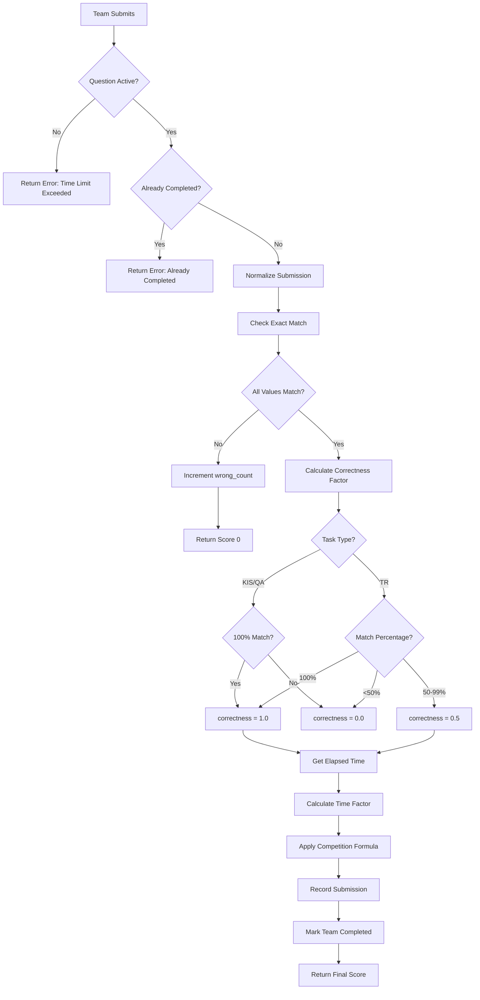
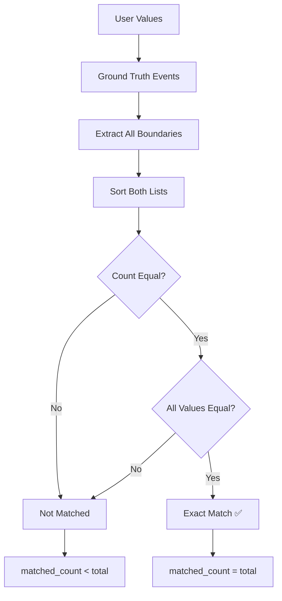

# Scoring Logic - AIC 2025 Scoring Server (Competition Mode)

## Overview

The **competition mode scoring system** uses exact matching with time-based penalties. Teams must match groundtruth exactly (no tolerance), and scores decrease based on submission time and wrong attempts.

## Core Concepts

### 1. Events

An event is defined by a start and end point:
- **Ground Truth Event:** `(start, end)` from CSV (dash-separated)
- **User Values:** Must match ALL event boundaries exactly

Example:
```
Ground Truth: "4890-5000-5001-5020" → Events: [(4890,5000), (5001,5020)]
User Must Submit: 4890, 5000, 5001, 5020 (all 4 values)
```

### 2. Exact Match (No Tolerance)

**Competition mode requires exact matching:**
- No tolerance range
- User values must match groundtruth boundaries precisely
- One mismatch = incorrect submission

```
Ground Truth Events: [(4890,5000), (5001,5020)]
Correct: [4890, 5000, 5001, 5020] ✅
Wrong: [4890, 5000, 5001, 5021] ❌ (5021 != 5020)
Wrong: [4890, 5000] ❌ (missing events)
```

### 3. Competition Formula

Score depends on **time** and **penalties**:

```
Score = max(0, P_base + (P_max - P_base) × fT(t) - k × P_penalty) × correctness_factor
```

Where:
- **fT(t)** = Time factor = `1 - (t_submit / T_task)`
- **P_max** = Maximum score = 100
- **P_base** = Base score = 50
- **P_penalty** = Penalty per wrong submission = 10
- **k** = Number of wrong submissions before correct answer
- **T_task** = Time limit (default 300s)
- **t_submit** = Time elapsed when submitting correct answer
- **correctness_factor** = Task-dependent (see below)

## Competition Scoring Algorithm

### High-Level Flow



### Detailed Steps

#### 1. Check Exact Match



#### 2. Calculate Correctness Factor

**For KIS/QA (All-or-Nothing):**
```python
if matched == total:
    correctness_factor = 1.0
else:
    correctness_factor = 0.0
```

**For TR (TRAKE - Partial Credit):**
```python
percentage = matched / total
if percentage >= 1.0:
    correctness_factor = 1.0  # Full score
elif percentage >= 0.5:
    correctness_factor = 0.5  # Half score
else:
    correctness_factor = 0.0  # No score
```

#### 3. Calculate Time Factor

```python
def calculate_time_factor(t_submit: float, t_task: float) -> float:
    """
    Time factor: fT(t) = 1 - (t_submit / T_task)
    
    - t_submit: Seconds elapsed since question start
    - t_task: Time limit (e.g., 300s)
    
    Returns: Value between 0 and 1
    """
    if t_task <= 0:
        return 0.0
    
    factor = 1.0 - (t_submit / t_task)
    return max(0.0, min(1.0, factor))
```

**Example:**
```
Submit at 30s, time limit 300s:
fT(30) = 1 - (30/300) = 1 - 0.1 = 0.9

Submit at 150s:
fT(150) = 1 - (150/300) = 1 - 0.5 = 0.5

Submit at 300s:
fT(300) = 1 - (300/300) = 0.0
```

#### 4. Apply Competition Formula

```python
def calculate_final_score(
    params: ScoringParams,
    t_submit: float,
    k: int,
    correctness_factor: float
) -> float:
    """
    Final score calculation
    
    Formula:
    Score = max(0, P_base + (P_max - P_base) × fT(t) - k × P_penalty) × correctness
    
    Args:
        params: Scoring parameters (p_max, p_base, p_penalty, time_limit)
        t_submit: Time elapsed when correct answer submitted
        k: Number of wrong attempts before correct
        correctness_factor: 0.0, 0.5, or 1.0 depending on task type
    
    Returns:
        Final score (0-100)
    """
    # Calculate time factor
    time_factor = calculate_time_factor(t_submit, params.time_limit)
    
    # Apply formula
    score = (
        params.p_base + 
        (params.p_max - params.p_base) * time_factor - 
        k * params.p_penalty
    ) * correctness_factor
    
    # Ensure non-negative
    return max(0.0, score)
```

**Example Calculation:**

```python
# Parameters
p_max = 100
p_base = 50
p_penalty = 10
time_limit = 300

# Scenario 1: Submit at 30s with 1 wrong attempt, full correct
t_submit = 30
k = 1
correctness = 1.0

fT = 1 - (30/300) = 0.9
score = (50 + (100-50) × 0.9 - 1 × 10) × 1.0
      = (50 + 45 - 10) × 1.0
      = 85.0

# Scenario 2: Submit at 150s with 0 wrong attempts, full correct
t_submit = 150
k = 0
correctness = 1.0

fT = 1 - (150/300) = 0.5
score = (50 + (100-50) × 0.5 - 0 × 10) × 1.0
      = (50 + 25 - 0) × 1.0
      = 75.0

# Scenario 3: Submit at 30s with 0 wrong attempts, TR 70% match
t_submit = 30
k = 0
correctness = 0.5  # 70% → half score

fT = 1 - (30/300) = 0.9
score = (50 + (100-50) × 0.9 - 0 × 10) × 0.5
      = (50 + 45 - 0) × 0.5
      = 47.5
```

## Competition Mode Examples

### Example 1: TR Task - Full Match, Quick Submission

**Ground Truth:**
```
Question 1: TR, V017
Points: "4890-5000-5001-5020"
Events: [(4890,5000), (5001,5020)]
```

**Submission:**
```json
{
  "team_id": "team_01",
  "question_id": 1,
  "answerSets": [{
    "answers": [
      {"text": "TR-V017-4890,5000,5001,5020"}
    ]
  }]
}
```

**Scoring:**
```
User Values: [4890, 5000, 5001, 5020]
GT Events: [(4890,5000), (5001,5020)]
GT Boundaries: [4890, 5000, 5001, 5020]

Exact Match Check:
  User: [4890, 5000, 5001, 5020]
  GT:   [4890, 5000, 5001, 5020]
  Result: MATCH ✅

Matched: 4/4 = 100%
Correctness Factor (TR, 100%): 1.0

Time: 15s elapsed
Time Factor: fT = 1 - (15/300) = 0.95

Wrong Attempts: 0

Score = (50 + (100-50) × 0.95 - 0 × 10) × 1.0
      = (50 + 47.5 - 0) × 1.0
      = 97.5
```

**Response:**
```json
{
  "success": true,
  "correctness": "full",
  "score": 97.5,
  "detail": {
    "matched_events": 4,
    "total_events": 4,
    "wrong_attempts": 0,
    "elapsed_time": 15.0,
    "time_factor": 0.95
  }
}
```

### Example 2: TR Task - Out of Range

### Example 2: TR Task - Partial Match (70%)

**Ground Truth:**
```
Question 1: TR, V017
Points: "4890-5000-5001-5020"
Events: [(4890,5000), (5001,5020)]
Boundaries: [4890, 5000, 5001, 5020]
```

**Submission:**
```json
{
  "team_id": "team_02",
  "question_id": 1,
  "answerSets": [{
    "answers": [
      {"text": "TR-V017-4890,5000,5001"}
    ]
  }]
}
```

**Scoring:**
```
User Values: [4890, 5000, 5001]
GT Boundaries: [4890, 5000, 5001, 5020]

Exact Match Check:
  User submitted: 3 values
  GT requires: 4 values
  Result: NOT EXACT MATCH ❌

Matched: 3/4 = 75%
Correctness Factor (TR, 75%): 0.5 (50-99% = half score)

Time: 20s elapsed
Time Factor: fT = 1 - (20/300) = 0.933

Wrong Attempts: 0

Score = (50 + (100-50) × 0.933 - 0 × 10) × 0.5
      = (50 + 46.65 - 0) × 0.5
      = 96.65 × 0.5
      = 48.3
```

**Response:**
```json
{
  "success": true,
  "correctness": "partial",
  "score": 48.3,
  "detail": {
    "matched_events": 3,
    "total_events": 4,
    "wrong_attempts": 0,
    "elapsed_time": 20.0,
    "time_factor": 0.933
  }
}
```

### Example 3: Wrong Then Correct (Penalty)

**Ground Truth:**
```
Question 2: KIS, V017
Points: "4890-5000-5001-5020"
Events: [(4890,5000), (5001,5020)]
Boundaries: [4890, 5000, 5001, 5020]
```

**Submission 1 (Wrong):**
```json
{
  "team_id": "team_03",
  "question_id": 2,
  "answerSets": [{
    "answers": [
      {"mediaItemName": "V017", "start": "1000", "end": "1000"},
      {"mediaItemName": "V017", "start": "2000", "end": "2000"}
    ]
  }]
}
```

**Result 1:**
```
User Values: [1000, 2000]
GT Boundaries: [4890, 5000, 5001, 5020]
Match: NO ❌

wrong_count incremented: 0 → 1

Response:
{
  "success": false,
  "correctness": "incorrect",
  "score": 0,
  "detail": {
    "matched_events": 0,
    "total_events": 4,
    "wrong_attempts": 1,
    "message": "Wrong answer. Try again with penalty."
  }
}
```

**Submission 2 (Correct):**
```json
{
  "team_id": "team_03",
  "question_id": 2,
  "answerSets": [{
    "answers": [
      {"mediaItemName": "V017", "start": "4890", "end": "4890"},
      {"mediaItemName": "V017", "start": "5000", "end": "5000"},
      {"mediaItemName": "V017", "start": "5001", "end": "5001"},
      {"mediaItemName": "V017", "start": "5020", "end": "5020"}
    ]
  }]
}
```

**Result 2:**
```
User Values: [4890, 5000, 5001, 5020]
GT Boundaries: [4890, 5000, 5001, 5020]
Match: YES ✅

Matched: 4/4 = 100%
Correctness Factor (KIS, 100%): 1.0

Time: 45s elapsed
Time Factor: fT = 1 - (45/300) = 0.85

Wrong Attempts: 1 (from previous submission)

Score = (50 + (100-50) × 0.85 - 1 × 10) × 1.0
      = (50 + 42.5 - 10) × 1.0
      = 82.5

Team marked as completed.
```

**Response:**
```json
{
  "success": true,
  "correctness": "full",
  "score": 82.5,
  "detail": {
    "matched_events": 4,
    "total_events": 4,
    "wrong_attempts": 1,
    "elapsed_time": 45.0,
    "time_factor": 0.85
  }
}
```

**Scoring Event 1:**
```
Ground Truth Range (ms): [10000, 20000]
User Submitted: [10001, 20001]

For start point:
  GT: 10000, User: 10001
  Midpoint: 10000 + tolerance in ms
  Score calculation in ms space
  
For end point:
  GT: 20000, User: 20001
  Similar calculation
  
Final Event 1 Score: ~99.99
```

**Scoring Event 2:**
```
Similar high score due to 1ms difference
```

**Final Score:** ~99.99

### Example 4: Missing Events

**User Submission:**
```json
{
  "text": "TR-V017-4999"
}
```

**Scoring:**
```
Event 1: (4945, 5010) with user value 4999 → Score calculated
Event 2: (5001, 5020) with NO user value → Score = 0.0

Aggregation (mean): (calculated_score + 0.0) / 2
```

## Aggregation Methods

### Mean (Default)

Average of all event scores:
```
final_score = sum(event_scores) / num_events
```

**Use Case:** Balanced evaluation, one bad event doesn't fail entire submission

**Example:**
```
Event Scores: [80.0, 100.0, 60.0]
Final: (80 + 100 + 60) / 3 = 80.0
```

### Minimum

Take the lowest score:
```
final_score = min(event_scores)
```

**Use Case:** Strict mode, all events must be good

**Example:**
```
Event Scores: [80.0, 100.0, 60.0]
Final: min(80, 100, 60) = 60.0
```

### Sum

Total of all scores:
```
final_score = sum(event_scores)
```

**Use Case:** Reward finding multiple events

**Example:**
```
Event Scores: [80.0, 100.0, 60.0]
Final: 80 + 100 + 60 = 240.0
```

## Edge Cases

### 1. No User Events

```python
user_values = []
# All event scores = 0.0
final_score = 0.0
```

### 2. More User Events Than GT

```python
gt_events = [(4945, 5010), (5001, 5020)]  # 2 events
user_values = [4999, 5001, 5050]          # 3 values

# Score only first 2 user values against GT events
# Extra user value (5050) is ignored
```

### 3. Fewer User Events Than GT

```python
gt_events = [(4945, 5010), (5001, 5020)]  # 2 events
user_values = [4999]                       # 1 value

# Score event 1 with user value
# Score event 2 with 0.0 (missing)
```

### 4. User Value Exactly at Boundary

```python
event = (4945, 5010)
tolerance = 12.0
valid_range = [4933, 5022]

user = 4933  # Exactly at range_start
# Still valid! Score calculated normally
```

## Parameter Tuning Guide

### Tolerance

**Effect:** Controls acceptable deviation from event

```
Low Tolerance (e.g., 5 frames):
  - Stricter evaluation
  - Smaller valid range
  - Higher skill required

High Tolerance (e.g., 25 frames):
  - More forgiving
  - Larger valid range
  - Easier to score
```

**Recommendation:** 
- TR: 10-15 frames (at 25 fps, this is 0.4-0.6 seconds)
- KIS/QA: 300-500 ms (converted to frames at runtime)

### Decay Rate

**Effect:** How fast score decreases with distance

```
Low Decay (e.g., 0.5):
  - Slower score decrease
  - More lenient on distance
  - Flatter scoring curve

High Decay (e.g., 2.0):
  - Faster score decrease
  - Stricter on distance
  - Steeper scoring curve
```

**Recommendation:** Start with 1.0, adjust based on score distribution

### Max Score

**Effect:** Ceiling for event scores

```
Standard: 100.0
```

Can be increased for weighted events, but typically keep at 100.0

### FPS

**Effect:** Converts milliseconds to frames for KIS/QA tasks

```
fps = 25.0
user_ms = 10000
user_frame = 10000 / (1000 / 25) = 250
```

## Summary

### Key Differences: Competition Mode vs Old System

| Aspect | Old System | Competition Mode |
|--------|-----------|------------------|
| **Matching** | Tolerance-based (±12 frames) | Exact match only |
| **Timing** | User creates session | Server controls timing |
| **Penalties** | None | -10 points per wrong attempt |
| **Scoring** | Distance-based decay | Time-based formula |
| **Correctness** | Per-event scoring | All-or-nothing (KIS/QA) or partial (TR) |
| **Multiple Submissions** | Allowed | Only until correct answer |

### Competition Formula Quick Reference

```
Score = max(0, P_base + (P_max - P_base) × fT(t) - k × P_penalty) × correctness

where:
  fT(t) = 1 - (t_submit / T_task)
  P_max = 100
  P_base = 50
  P_penalty = 10
  T_task = 300s
  correctness = 1.0 (full), 0.5 (half), or 0.0 (wrong)
```

### Correctness Rules

**KIS / QA:**
- 100% match → correctness = 1.0
- <100% match → correctness = 0.0

**TR (TRAKE):**
- 100% match → correctness = 1.0
- 50-99% match → correctness = 0.5
- <50% match → correctness = 0.0

### Ranking Logic

Leaderboard ranks teams by:
1. **Score** (descending) - higher is better
2. **Time** (ascending) - faster is better (tiebreaker)

### Implementation Notes

**Data Storage:**
- In-memory session management
- No database required
- Resets on server restart

**Time Tracking:**
- Server tracks start_time per question
- Buffer time (10s) allows late submissions
- Elapsed time calculated on each submission

**Submission Flow:**
1. Admin starts question → Session created
2. Team submits → Normalized and checked
3. Wrong answer → Increment penalty counter
4. Correct answer → Calculate score, mark completed
5. Duplicate submission → Reject with error

**Testing:**
- 25 unit tests in `tests/test_scoring.py`
- All passing (exact match, time factor, penalties, etc.)

### Performance

Time Complexity:
- **Per Event:** O(1) - constant time scoring
- **Total:** O(n) where n = number of events
- **Memory:** O(n) for storing results

Typical performance:
- 5 events: < 1ms
- 100 events: < 10ms

### Validation Order

1. Check question exists
2. Validate video ID match
3. Normalize body format
4. Parse events
5. Score each event
6. Aggregate scores
7. Return response

## Testing Recommendations

### Unit Tests

Test individual scoring functions:
```python
def test_score_perfect_match():
    score = score_event_frame(4945, 5010, 4977, 12.0, 100.0, 1.0)
    assert score > 99.0

def test_score_out_of_range():
    score = score_event_frame(4945, 5010, 3000, 12.0, 100.0, 1.0)
    assert score == 0.0
```

### Integration Tests

Test complete submissions:
```bash
# Perfect submission
curl -X POST http://localhost:8000/submit \
  -d '{"text": "TR-V017-4945,5010"}'
# Expected: score ≈ 100.0

# Boundary test
curl -X POST http://localhost:8000/submit \
  -d '{"text": "TR-V017-4933,5022"}'
# Expected: score < 100.0 but > 0

# Out of range
curl -X POST http://localhost:8000/submit \
  -d '{"text": "TR-V017-3000,6000"}'
# Expected: score = 0.0
```

---

**Last Updated:** 2025-11-07
