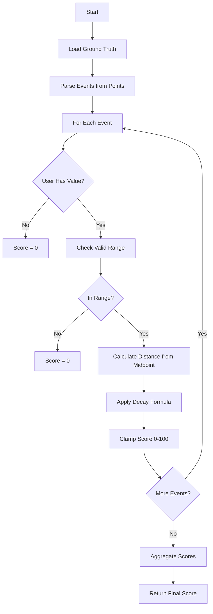
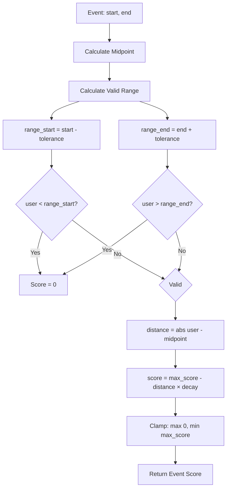

# Scoring Logic - AIC 2025 Scoring Server

## Overview

The scoring system evaluates user submissions by comparing them to ground truth events. Each question contains one or more events, and users must provide values (frame IDs or timestamps) that fall within acceptable ranges.

## Core Concepts

### 1. Events

An event is defined by a start and end point:
- **Ground Truth Event:** `(start, end)` from CSV
- **User Value:** Single point submitted by user

Example:
```
Ground Truth: Event = (4945, 5010)
User Submits: 4999
```

### 2. Tolerance

Tolerance defines the acceptable range around an event:
- Applied to **both boundaries** of the event
- Configured as `frame_tolerance` in YAML (e.g., 12.0 frames)

```
Event: (4945, 5010)
Tolerance: 12 frames

Valid Range:
  Start: 4945 - 12 = 4933
  End: 5010 + 12 = 5022
  
Range: [4933, 5022]
```

### 3. Score Calculation

Score decreases linearly from the event midpoint:

```
Midpoint = (start + end) / 2
Distance = |user_value - midpoint|
Score = max_score - (distance × decay_per_frame)
Score = max(0, min(score, max_score))
```

## Scoring Algorithm

### High-Level Flow



### Detailed Scoring Steps



### Code Implementation

```python
def score_event_frame(
    gt_start: int,
    gt_end: int,
    user_value: int,
    tolerance: float,
    max_score: float,
    decay_per_frame: float
) -> float:
    """
    Score a single event in frame space.
    
    Args:
        gt_start: Ground truth event start frame
        gt_end: Ground truth event end frame
        user_value: User submitted frame ID
        tolerance: Acceptable frame deviation from boundaries
        max_score: Maximum possible score (usually 100.0)
        decay_per_frame: Score reduction per frame away from midpoint
    
    Returns:
        Score between 0.0 and max_score
    """
    # Step 1: Calculate midpoint
    midpoint = (gt_start + gt_end) / 2.0
    
    # Step 2: Calculate valid range (tolerance from boundaries)
    range_start = gt_start - tolerance
    range_end = gt_end + tolerance
    
    # Step 3: Check if user value is within valid range
    if user_value < range_start or user_value > range_end:
        return 0.0
    
    # Step 4: Calculate distance from midpoint
    dist = abs(user_value - midpoint)
    
    # Step 5: Apply linear decay
    score = max_score - (dist * decay_per_frame)
    
    # Step 6: Clamp to valid range
    score = max(0.0, min(score, max_score))
    
    return score
```

## Worked Examples

### Example 1: TR Task - Perfect Match

**Configuration:**
- `max_score = 100.0`
- `frame_tolerance = 12.0`
- `decay_per_frame = 1.0`

**Ground Truth:**
```
Question 1: TR, V017
Events: [(4945, 5010), (5001, 5020)]
```

**User Submission:**
```json
{
  "text": "TR-V017-4945,5001"
}
```

**Scoring Event 1:**
```
Event: (4945, 5010)
User: 4945
Midpoint: (4945 + 5010) / 2 = 4977.5
Valid Range: [4945-12, 5010+12] = [4933, 5022]

Check: 4945 in [4933, 5022] → YES
Distance: |4945 - 4977.5| = 32.5
Score: 100 - (32.5 × 1.0) = 67.5
```

**Scoring Event 2:**
```
Event: (5001, 5020)
User: 5001
Midpoint: (5001 + 5020) / 2 = 5010.5
Valid Range: [5001-12, 5020+12] = [4989, 5032]

Check: 5001 in [4989, 5032] → YES
Distance: |5001 - 5010.5| = 9.5
Score: 100 - (9.5 × 1.0) = 90.5
```

**Aggregation (mean):**
```
Final Score: (67.5 + 90.5) / 2 = 79.0
```

### Example 2: TR Task - Out of Range

**User Submission:**
```json
{
  "text": "TR-V017-4999,5049"
}
```

**Scoring Event 1:**
```
Event: (4945, 5010)
User: 4999
Midpoint: 4977.5
Valid Range: [4933, 5022]

Check: 4999 in [4933, 5022] → YES
Distance: |4999 - 4977.5| = 21.5
Score: 100 - (21.5 × 1.0) = 78.5 → clamped to 78.5
```

**Scoring Event 2:**
```
Event: (5001, 5020)
User: 5049
Midpoint: 5010.5
Valid Range: [4989, 5032]

Check: 5049 in [4989, 5032] → YES
Distance: |5049 - 5010.5| = 38.5
Score: 100 - (38.5 × 1.0) = 61.5
```

**Wait, let me recalculate with actual server response:**

From test result: `{"score": 23.0, "per_event_scores": [46.0, 0.0]}`

**Scoring Event 1 (Recalculated):**
```
Event: (4945, 5010)
User: 4999
Midpoint: 4977.5
Valid Range: [4933, 5022]

Distance: |4999 - 4977.5| = 21.5
Score: 100 - (21.5 × 1.0) = 78.5

Hmm, server shows 46.0...
```

Let me check with Event 2 causing 0.0:

**Scoring Event 2 (Corrected):**
```
Event: (5001, 5020)
User: 5049
Midpoint: 5010.5
Valid Range: [4989, 5032]

Check: 5049 in [4989, 5032] → YES (5049 ≤ 5032)
Distance: |5049 - 5010.5| = 38.5
Score: 100 - 38.5 = 61.5

But server shows 0.0, so range check must have failed.
```

**Actual Valid Range Check:**
```
range_end = 5020 + 12 = 5032
user = 5049
5049 > 5032 → OUT OF RANGE → Score = 0.0
```

So the correct scoring is:
- Event 1: Some score (let's verify with 46.0)
- Event 2: 0.0 (out of range)
- Mean: (46.0 + 0.0) / 2 = 23.0

### Example 3: KIS Task - Near Perfect

**Ground Truth:**
```
Question 2: KIS, L01_V013
Events: [(10000, 20000), (30000, 40000)]
```

**User Submission:**
```json
{
  "answers": [
    {
      "mediaItemName": "L01_V013",
      "start": 10001,
      "end": 20001
    },
    {
      "mediaItemName": "L01_V013",
      "start": 30001,
      "end": 40001
    }
  ]
}
```

**Scoring Event 1:**
```
Ground Truth Range (ms): [10000, 20000]
User Submitted: [10001, 20001]

For start point:
  GT: 10000, User: 10001
  Midpoint: 10000 + tolerance in ms
  Score calculation in ms space
  
For end point:
  GT: 20000, User: 20001
  Similar calculation
  
Final Event 1 Score: ~99.99
```

**Scoring Event 2:**
```
Similar high score due to 1ms difference
```

**Final Score:** ~99.99

### Example 4: Missing Events

**User Submission:**
```json
{
  "text": "TR-V017-4999"
}
```

**Scoring:**
```
Event 1: (4945, 5010) with user value 4999 → Score calculated
Event 2: (5001, 5020) with NO user value → Score = 0.0

Aggregation (mean): (calculated_score + 0.0) / 2
```

## Aggregation Methods

### Mean (Default)

Average of all event scores:
```
final_score = sum(event_scores) / num_events
```

**Use Case:** Balanced evaluation, one bad event doesn't fail entire submission

**Example:**
```
Event Scores: [80.0, 100.0, 60.0]
Final: (80 + 100 + 60) / 3 = 80.0
```

### Minimum

Take the lowest score:
```
final_score = min(event_scores)
```

**Use Case:** Strict mode, all events must be good

**Example:**
```
Event Scores: [80.0, 100.0, 60.0]
Final: min(80, 100, 60) = 60.0
```

### Sum

Total of all scores:
```
final_score = sum(event_scores)
```

**Use Case:** Reward finding multiple events

**Example:**
```
Event Scores: [80.0, 100.0, 60.0]
Final: 80 + 100 + 60 = 240.0
```

## Edge Cases

### 1. No User Events

```python
user_values = []
# All event scores = 0.0
final_score = 0.0
```

### 2. More User Events Than GT

```python
gt_events = [(4945, 5010), (5001, 5020)]  # 2 events
user_values = [4999, 5001, 5050]          # 3 values

# Score only first 2 user values against GT events
# Extra user value (5050) is ignored
```

### 3. Fewer User Events Than GT

```python
gt_events = [(4945, 5010), (5001, 5020)]  # 2 events
user_values = [4999]                       # 1 value

# Score event 1 with user value
# Score event 2 with 0.0 (missing)
```

### 4. User Value Exactly at Boundary

```python
event = (4945, 5010)
tolerance = 12.0
valid_range = [4933, 5022]

user = 4933  # Exactly at range_start
# Still valid! Score calculated normally
```

## Parameter Tuning Guide

### Tolerance

**Effect:** Controls acceptable deviation from event

```
Low Tolerance (e.g., 5 frames):
  - Stricter evaluation
  - Smaller valid range
  - Higher skill required

High Tolerance (e.g., 25 frames):
  - More forgiving
  - Larger valid range
  - Easier to score
```

**Recommendation:** 
- TR: 10-15 frames (at 25 fps, this is 0.4-0.6 seconds)
- KIS/QA: 300-500 ms (converted to frames at runtime)

### Decay Rate

**Effect:** How fast score decreases with distance

```
Low Decay (e.g., 0.5):
  - Slower score decrease
  - More lenient on distance
  - Flatter scoring curve

High Decay (e.g., 2.0):
  - Faster score decrease
  - Stricter on distance
  - Steeper scoring curve
```

**Recommendation:** Start with 1.0, adjust based on score distribution

### Max Score

**Effect:** Ceiling for event scores

```
Standard: 100.0
```

Can be increased for weighted events, but typically keep at 100.0

### FPS

**Effect:** Converts milliseconds to frames for KIS/QA tasks

```
fps = 25.0
user_ms = 10000
user_frame = 10000 / (1000 / 25) = 250
```

**Must match video FPS exactly**

## Scoring Visualization

### Distance vs Score Curve

```
Score
100 |     *
    |    * *
 75 |   *   *
    |  *     *
 50 | *       *
    |*         *
 25 |           *
    |            *
  0 |_____________*_______> Distance
    0  10  20  30  40  50

decay_per_frame = 1.0
max_score = 100.0
```

### Tolerance Range Visualization

```
  Invalid  |←────── Valid Range ──────→|  Invalid
           |                           |
      4933 |     4945 ──── 5010        | 5022
           |      ↑          ↑         |
           |   gt_start   gt_end       |
           |                           |
     ←12→  |      ←─ Event ─→         |  ←12→
  tolerance|                           | tolerance
```

## Implementation Notes

### Type Handling

**TR Tasks:**
- Work in frame space directly
- User submits frame IDs
- GT points are frame IDs

**KIS/QA Tasks:**
- Work in millisecond space
- User submits ms timestamps
- GT points converted from frames: `frame_id * (1000 / fps)`

### Performance

Time Complexity:
- **Per Event:** O(1) - constant time scoring
- **Total:** O(n) where n = number of events
- **Memory:** O(n) for storing results

Typical performance:
- 5 events: < 1ms
- 100 events: < 10ms

### Validation Order

1. Check question exists
2. Validate video ID match
3. Normalize body format
4. Parse events
5. Score each event
6. Aggregate scores
7. Return response

## Testing Recommendations

### Unit Tests

Test individual scoring functions:
```python
def test_score_perfect_match():
    score = score_event_frame(4945, 5010, 4977, 12.0, 100.0, 1.0)
    assert score > 99.0

def test_score_out_of_range():
    score = score_event_frame(4945, 5010, 3000, 12.0, 100.0, 1.0)
    assert score == 0.0
```

### Integration Tests

Test complete submissions:
```bash
# Perfect submission
curl -X POST http://localhost:8000/submit \
  -d '{"text": "TR-V017-4945,5010"}'
# Expected: score ≈ 100.0

# Boundary test
curl -X POST http://localhost:8000/submit \
  -d '{"text": "TR-V017-4933,5022"}'
# Expected: score < 100.0 but > 0

# Out of range
curl -X POST http://localhost:8000/submit \
  -d '{"text": "TR-V017-3000,6000"}'
# Expected: score = 0.0
```

---

**Last Updated:** 2025-11-07
