# System Design - AIC 2025 Scoring Server (Competition Mode + Leaderboard UI)

## Architecture Overview


**Key Features:**
- Server-controlled timing (admin starts/stops questions)
- Session management tracks real + fake teams
- Penalty system for wrong submissions
- Time-based scoring with exact match
- Real-time leaderboard UI with simulated competitors
- All API submissions mapped to "0THING2LOSE" team

## Component Architecture

### 1. FastAPI Server (`app/main.py`)

Main application server with admin, public, and UI endpoints:


**Responsibilities:**
- Handle HTTP requests/responses
- CORS middleware for development
- Load groundtruth on startup
- Manage question sessions (real + fake teams)
- Track team submissions
- Force map all submissions to "0THING2LOSE"
- Calculate scores with time and penalties
- Generate leaderboard with simulated competitors
- Serve real-time UI

### 2. Data Models (`app/models.py`)


**GroundTruth:**
- Represents one question from CSV
- `points`: Even-length list, each pair = 1 event (dash-separated)

**NormalizedSubmission:**
- Unified format after normalization
- `values`: User submitted values (ms or frame_id)

**QuestionSession:**
- Server-controlled question timing
- Tracks all team submissions for the question
- Manages active/inactive state
- Contains both real teams and fake teams for leaderboard

**TeamSubmission:**
- Per-team tracking within a question
- Records wrong attempts (wrong_count) and correct attempts (correct_count)
- Stores submission timing
- Stores final score after completion

**ScoringParams:**
- Competition scoring parameters
- p_max=100, p_base=50, p_penalty=10
- time_limit=300s, buffer_time=10s

### 3. Fake Teams Generator (`app/fake_teams.py`)

**NEW COMPONENT** for leaderboard simulation:

```python
# Key Functions:
- generate_fake_team_names(count) → List[str]
  # Creates 15 unique team names
  
- generate_weighted_score() → float
  # Score distribution: 80-100 (15%), 60-80 (30%), 40-60 (35%), 0-40 (20%)
  
- should_submit() → bool
  # 85% teams submit, 15% don't
  
- generate_submission_attempts() → (wrong, correct)
  # 60% correct first try
  # 25% 1 wrong then correct
  # 10% 2-3 wrong then correct
  # 5% only wrong attempts
```

### 4. Session Manager (`app/session.py`)

Server-controlled question timing and team tracking:


**Key Functions:**
- `start_question()`: Admin starts timer
- `stop_question()`: Admin stops manually
- `is_question_active()`: Check if within time limit + buffer
- `get_elapsed_time()`: Time since start
- `record_submission()`: Track team attempts
- `get_question_leaderboard()`: Generate rankings

### 4. Groundtruth Loader (`app/groundtruth_loader.py`)


**Validations:**
- Points are dash-separated (`-`)
- Points count must be even
- Points must be sorted ascending
- All required fields present

### 5. Normalizer (`app/normalizer.py`)

Converts different body formats to unified `NormalizedSubmission`:


**KIS Format:**
- Multiple `answers` with `mediaItemName`, `start`, `end`
- Each answer represents one timestamp
- Must match all groundtruth timestamps exactly

**QA Format:**
- Single `text` with pattern: `QA-<ANSWER>-<VIDEO_ID>-<MS1>,<MS2>,...`
- Comma-separated milliseconds in one text
- Must match all groundtruth timestamps exactly

**TR Format:**
- Single `text` with pattern: `TR-<VIDEO_ID>-<FRAME_ID1>,<FRAME_ID2>,...`
- Comma-separated frame IDs in one text
- Supports partial matching (50-99% = half score)

### 6. Competition Scorer (`app/scoring.py`)

**Complete Rewrite for Competition Mode:**

```mermaid
flowchart TD
    A[Start Scoring] --> B[Parse GT Events]
    B --> C[Check Exact Match]
    C --> D{All Matched?}
    D -->|Yes| E[Calculate Correctness Factor]
    D -->|No| E
    E --> F{Task Type?}
    F -->|KIS/QA| G{100% Match?}
    F -->|TR| H{Match Percentage?}
    G -->|Yes| I[correctness = 1.0]
    G -->|No| J[correctness = 0.0]
    H -->|100%| I
    H -->|50-99%| K[correctness = 0.5]
    H -->|<50%| J
    I --> L[Calculate Time Factor]
    J --> M[Return Score 0]
    K --> L
    L --> N[fT = 1 - t/T]
    N --> O[Apply Formula]
    O --> P[Score = max 0, P_base + P_max-P_base × fT - k × P_penalty × correctness]
    P --> Q[Return Final Score]
```



**Key Functions:**

1. **`calculate_time_factor(t_submit, t_task)`**
   - Formula: `fT(t) = 1 - (t_submit / T_task)`
   - Earlier = higher multiplier

2. **`check_exact_match(user_values, gt_events, task_type)`**
   - No tolerance - must match exactly
   - Returns (matched_count, total_events)

3. **`calculate_correctness_factor(matched, total, task_type)`**
   - KIS/QA: 100% or nothing
   - TR: 100%=1.0, 50-99%=0.5, <50%=0.0

4. **`calculate_final_score(params, t_submit, k, correctness)`**
   - Full competition formula
   - Returns max(0, score)
    J -->|Yes| C
    J -->|No| K[Aggregate Scores]
    K --> L{Aggregation?}
    L -->|mean| M[Average]
    L -->|min| N[Minimum]
    L -->|sum| O[Sum]
    M --> P[Final Score]
    N --> P
    O --> P
```

**Key Functions:**

- `points_to_events()`: Converts `[p1,p2,p3,p4]` → `[(p1,p2), (p3,p4)]`
- `score_event_ms()`: Score for KIS/QA (milliseconds)
- `score_event_frame()`: Score for TR (frame_id)
- `score_submission()`: Main scoring orchestrator

## Data Flow

### Complete Request Flow


### Config Loading Strategy


**Benefits:**
- No server restart needed
- Dynamic question switching
- Easy testing

## File Structure

```
scoring-server/
├── app/
│   ├── __init__.py           # Package marker
│   ├── main.py               # FastAPI app, endpoints, CORS
│   ├── models.py             # Pydantic data models
│   ├── config.py             # YAML config loader
│   ├── groundtruth_loader.py # CSV parser with validation
│   ├── normalizer.py         # Body format normalizers (KIS/QA/TR)
│   ├── scoring.py            # Core scoring algorithms
│   └── utils.py              # Helper functions
├── config/
│   └── current_task.yaml     # Active question config
├── data/
│   └── groundtruth.csv       # Question groundtruth data
├── tests/
│   ├── __init__.py
│   └── test_scoring.py       # Unit tests
├── docs/
│   ├── system-design.md      # This file
│   └── scoring-logic.md      # Scoring algorithm details
├── requirements.txt          # Python dependencies
├── Dockerfile                # Container build
└── README.md                 # Quick start guide
```

## API Endpoints Detail

### GET `/`

**Purpose:** Health check

**Response:**
```json
{
  "status": "ok",
  "message": "AIC 2025 Scoring Server",
  "version": "1.0.0",
  "total_questions": 5
}
```

### GET `/config`

**Purpose:** View current active question configuration

**Response:**
```json
{
  "active_question_id": 1,
  "type": "TR",
  "video_id": "V017",
  "scene_id": "L26",
  "num_events": 2,
  "fps": 25.0,
  "max_score": 100.0,
  "frame_tolerance": 12.0,
  "aggregation": "mean"
}
```

### GET `/questions`

**Purpose:** List all available questions

**Response:**
```json
{
  "questions": [
    {
      "id": 1,
      "type": "TR",
      "video_id": "V017",
      "scene_id": "L26",
      "num_events": 2
    }
  ]
}
```

### POST `/submit`

**Purpose:** Submit answer and get score

**Request:** See README.md for format details

**Response:**
```json
{
  "success": true,
  "question_id": 1,
  "type": "TR",
  "video_id": "V017",
  "score": 23.0,
  "detail": {
    "per_event_scores": [46.0, 0.0],
    "gt_events": [[4890, 5000], [5001, 5020]],
    "user_values": [4999, 5049],
    "aggregation_method": "mean",
    "num_gt_events": 2,
    "num_user_events": 2
  }
}
```

## Error Handling


**Error Response Format:**
```json
{
  "detail": "Error message here"
}
```

## Deployment Options

### Local Development
```bash
uvicorn app.main:app --reload
```

### Production
```bash
uvicorn app.main:app --host 0.0.0.0 --port 8000 --workers 4
```

### Docker
```bash
docker build -t scoring-server .
docker run -p 8000:8000 scoring-server
```

### With Gunicorn
```bash
gunicorn app.main:app -w 4 -k uvicorn.workers.UvicornWorker
```

## Performance Considerations

- **CSV Loading:** Done once at startup, cached in memory
- **Config Loading:** Per-request (lightweight YAML parse)
- **Scoring:** O(n) where n = number of events
- **No Database:** All in-memory for speed

## Configuration Options

### `config/current_task.yaml`

```yaml
active_question_id: 1      # Which question is active
fps: 25.0                  # Video FPS for ms→frame conversion
max_score: 100.0           # Maximum score per event
frame_tolerance: 12.0      # Tolerance in frames (±from event boundaries)
decay_per_frame: 1.0       # Score decay rate per frame
aggregation: "mean"        # How to combine event scores: mean/min/sum
```

**Aggregation Strategies:**

- `mean`: Average score across all events (default)
- `min`: Take lowest score (strict, all events must be good)
- `sum`: Sum all scores (rewards multiple correct events)

## Real-time Leaderboard UI

### Frontend Architecture (`static/`)

```
static/
├── leaderboard.html    # Main UI structure
├── leaderboard.css     # Styling and animations
└── leaderboard.js      # Auto-refresh logic
```

**Key Features:**

1. **Auto-refresh:** Polls `/api/leaderboard-data` every 2 seconds
2. **Submission indicators:**
   - ✅ Green checkmark = correct submission
   - ❌ Red X = wrong submission
   - Shows count of each type
3. **Score color coding:**
   - High (80-100): Green gradient
   - Good (60-80): Light green
   - Medium (40-60): Amber/Yellow
   - Low (0-40): Red
4. **Team highlighting:**
   - "0THING2LOSE" = real team (purple gradient, ⭐ icon)
   - All other teams = fake/simulated
5. **Rankings:**
   - 🥇 Gold medal for 1st place
   - 🥈 Silver medal for 2nd place
   - 🥉 Bronze medal for 3rd place

### Data Flow


### API Response Format

```json
{
  "questions": [1, 2, 3, 4, 5],
  "teams": [
    {
      "team_name": "0THING2LOSE",
      "is_real": true,
      "questions": {
        "1": {
          "wrong_count": 1,
          "correct_count": 1,
          "score": 85.5
        },
        "2": {
          "wrong_count": 0,
          "correct_count": 1,
          "score": 92.0
        }
      },
      "total_score": 177.5
    },
    {
      "team_name": "CodeNinja",
      "is_real": false,
      "questions": {
        "1": {
          "wrong_count": 0,
          "correct_count": 1,
          "score": 88.3
        }
      },
      "total_score": 88.3
    }
  ]
}
```

## Testing Strategy

### Unit Tests (`tests/test_scoring.py`)

- Test `points_to_events()` conversion
- Test scoring functions with various distances
- Test aggregation methods (mean/min/sum)
- Test edge cases (missing events, out of range)
- Test competition formula with time factors
- Test exact match logic

### Integration Testing

Manual testing with curl:
```bash
curl -X POST http://localhost:8000/submit \
  -H "Content-Type: application/json" \
  -d @test_submission.json
```

## Future Enhancements

- Database backend for persistent storage
- User authentication and session management
- Leaderboard functionality
- Detailed analytics and reporting
- WebSocket for real-time updates
- Admin UI for managing questions

---

**Last Updated:** 2025-11-07
