# System Design - AIC 2025 Scoring Server (Modular Architecture)

## Architecture Overview

The system uses a **layered modular architecture** with clear separation between API routes, business logic, and support services.


**Key Features:**
- **Modular Architecture:** Separate API, Core, Services layers
- **Global State:** Centralized GT_TABLE via `app.state`
- **Server-controlled timing:** Admin starts/stops questions
- **Session management:** Tracks real + fake teams
- **Tolerance-based scoring:** Distance-weighted match quality
- **Real-time leaderboard:** Grid + table views with 20 real teams
- **Team registration:** Each real team registers to obtain a `team_session_id` token for submissions.

## Project Structure

```
app/
├── main.py                    # FastAPI entry point (~100 lines)
├── state.py                   # Global state (GT_TABLE)
├── models.py                  # Pydantic data models
├── utils.py                   # Utility functions
│
├── api/                       # API Layer - FastAPI routers
│   ├── __init__.py
│   ├── health.py             # GET / - Health check
│   ├── admin.py              # POST /admin/* - Admin controls
│   ├── submission.py         # POST /submit, GET /questions
│   ├── leaderboard.py        # GET /api/leaderboard-data, UI routes
│   └── config.py             # GET /config
│
├── core/                      # Core Business Logic
│   ├── __init__.py
│   ├── groundtruth.py        # Load CSV → GT_TABLE
│   ├── normalizer.py         # Parse & normalize KIS/QA/TR
│   ├── scoring.py            # Score with tolerance + distance
│   └── session.py            # Question session management
│
├── services/                  # Support Services
│   ├── __init__.py
│   └── fake_teams.py         # Generate fake leaderboard entries
```

## Component Architecture

### 1. API Layer (`app/api/`)

Handles HTTP requests and routes to core business logic.

**Routers:**
- **`health.py`**: Health check endpoint
  - `GET /` → Server status, version, question count
  
- **`admin.py`**: Admin management
  - `POST /admin/start-question` → Start question with timer
  - `POST /admin/stop-question` → Stop active question
  - `GET /admin/sessions` → List all sessions
  - `POST /admin/reset` → Reset all sessions

- **`submission.py`**: Team submissions
  - `POST /submit` → Submit answer (auto team_id/question_id)
  - `GET /questions` → List all available questions

- **`leaderboard.py`**: Leaderboard & UI
  - `GET /api/leaderboard-data` → JSON data for all questions
  - `GET /leaderboard-ui` → Serve HTML page
  - `GET /admin-dashboard` → Serve admin HTML

- **`config.py`**: Configuration
  - `GET /config` → Active question config + all questions

**Design Pattern:**
```python
# All routers use FastAPI's APIRouter
from fastapi import APIRouter
from app import state

router = APIRouter(prefix="/admin", tags=["admin"])

@router.post("/start-question")
async def start_question_endpoint(request: dict):
    # Access global state
    if question_id not in state.GT_TABLE:
        raise HTTPException(404, "Question not found")
    # ... business logic
```

### 2. Core Business Logic (`app/core/`)

The core layer contains all business logic, independent of HTTP/API concerns.

**Modules:**

**`groundtruth.py`** - Load ground truth data
```python
def load_groundtruth(csv_path: str) -> Dict[int, GroundTruth]:
    """Load CSV → Dict[question_id, GroundTruth]"""
    # Parse CSV, validate points (must be even-length)
    # Return GT_TABLE for global state
```

**`normalizer.py`** - Parse and normalize submissions
```python
def normalize_kis(body: dict, qid: int) -> NormalizedSubmission:
    """Parse KIS format → normalized values"""
    
def normalize_qa(body: dict, qid: int) -> NormalizedSubmission:
    """Parse QA-<answer>-<scene>_<video>-<ms1>,<ms2>"""
    # Validate: uppercase, no accents, no spaces
    
def normalize_tr(body: dict, qid: int) -> NormalizedSubmission:
    """Parse TR-<scene>_<video>-<frame1>,<frame2>"""
```

**`scoring.py`** - Score calculation with tolerance
```python
def score_submission(
    submission: NormalizedSubmission,
    gt: GroundTruth,
    elapsed_time: float,
    k: int,
    params: ScoringParams
) -> dict:
    """
    Calculate score with:
    - Tolerance-based matching (±2500ms KIS/QA, ±12 frames TR)
    - Distance-based quality (linear decay center → boundary)
    - Time factor (earlier = higher score)
    - Penalty (k wrong attempts)
    
    Returns: {score, correctness_factor, match_quality, ...}
    """
```

**`session.py`** - Question session management
```python
# Global session storage
active_questions: Dict[int, QuestionSession] = {}

def start_question(qid: int, time_limit: int, buffer: int) -> QuestionSession:
    """Start question timer, create session"""
    
def stop_question(qid: int):
    """Stop question, mark inactive"""
    
def is_question_active(qid: int) -> bool:
    """Check if within time limit + buffer"""
    
def record_submission(qid: int, team_id: str, is_correct: bool, score: float):
    """Track submission for team"""
    
def get_question_leaderboard(qid: int) -> List[dict]:
    """Get rankings for one question"""
```

**Data Models (`app/models.py`):**


**GroundTruth:**
- Represents one question from CSV
- `points`: Even-length list, each pair = 1 event

**NormalizedSubmission:**
- Unified format after normalization
- `values`: User submitted values (ms or frame_id)
- Includes scene_id and video_id validation

**QuestionSession:**
- Server-controlled question timing
- Tracks all team submissions
- Manages active/inactive state
- Contains both real teams and fake teams

**TeamSubmission:**
- Per-team tracking within a question
- Records wrong attempts (wrong_count) and correct attempts (correct_count)
- Stores submission timing
- Stores final score after completion

**ScoringParams:**
- Competition scoring parameters
- p_max=100, p_base=50, p_penalty=10
- time_limit=300s, buffer_time=10s

### 3. Support Services (`app/services/`)

**`fake_teams.py`** - Generate realistic fake team data

The system now uses **20 real AIC 2025 team names** instead of generic fake names:

```python
REAL_TEAM_NAMES = [
    "UIT@Dzeus", "TKU.TonNGoYsss", "UTE AI LAB",
    "HCMUS_DeepLearning_Team", "HCMIU-Beyond_Limits",
    "NLU_Knights", "HUST_ICT01", "Titan",
    "VGU_Guardian", "UIT_Together", "FPT_AI",
    "Zalo AI", "SOICT_BKAI", "VNUHCM_AI",
    "HCMUS_AIChallenge", "SGU_Warriors", "HUTECH_AI",
    "TDTU_MindSet", "UTH_Phoenix", "VNU_Hanoi_AI"
]

# Fake team pool used for leaderboard fillers
# Total: 19 fake teams + 1 real team = 20 teams on leaderboard
```

**Functions:**
```python
def generate_fake_teams(question_id: int, gt: GroundTruth, 
                       p_max: int, time_limit: int) -> Dict[str, TeamSubmission]:
    """
    Generate 19 fake teams with realistic behavior:
    - Score distribution: 80-100 (15%), 60-80 (30%), 40-60 (35%), 0-40 (20%)
    - Submission rate: 85% teams submit, 15% don't
    - Attempts: 60% first try, 25% 1 wrong, 10% 2-3 wrong, 5% only wrong
    - Time variance: ±30% of time limit
    """
```

**`leaderboard.py`** - Assemble leaderboard data

```python
def assemble_leaderboard_data(gt_table: Dict) -> dict:
    """
    Aggregate data from all question sessions:
    - Merge real teams + fake teams
    - Calculate per-question scores
    - Calculate total scores
    - Sort by total (desc) → time (asc)
    - Return: {questions: [...], teams: [...]}
    """
```
```

### 4. Global State (`app/state.py`)

Centralized global state accessible across all modules:

```python
from typing import Dict, Optional

# Global ground truth table
# Loaded at startup and accessible throughout the application
GT_TABLE: Optional[Dict] = None
```

**Usage Pattern:**
```python
# In main.py (startup)
from app import state
from app.core.groundtruth import load_groundtruth

@asynccontextmanager
async def lifespan(app: FastAPI):
    state.GT_TABLE = load_groundtruth("data/groundtruth.csv")
    yield

# In any router or module
from app import state

@router.get("/questions")
async def list_questions():
    if not state.GT_TABLE:
        return {"questions": []}
    
    for qid, gt in state.GT_TABLE.items():
        # ... use ground truth
```

**Benefits:**
- ✅ No dependency injection complexity
- ✅ Single source of truth
- ✅ Easy to access from any module
- ✅ FastAPI recommended pattern for global state

### 5. Session Manager (`app/core/session.py`)

Server-controlled question timing and team tracking:


**Key Functions:**
- `start_question()`: Admin starts timer
- `stop_question()`: Admin stops manually
- `is_question_active()`: Check if within time limit + buffer
- `get_elapsed_time()`: Time since start
- `record_submission()`: Track team attempts
- `get_question_leaderboard()`: Generate rankings

### 4. Groundtruth Loader (`app/groundtruth_loader.py`)


**Validations:**
- Points are dash-separated (`-`)
- Points count must be even
- Points must be sorted ascending
- All required fields present

### 5. Normalizer (`app/normalizer.py`)

Converts different body formats to unified `NormalizedSubmission`:


**KIS Format:**
- Multiple `answers` with `mediaItemName`, `start`, `end`
- Each answer represents one timestamp
- Must match all groundtruth timestamps exactly

**QA Format:**
- Single `text` with pattern: `QA-<ANSWER>-<VIDEO_ID>-<MS1>,<MS2>,...`
- Comma-separated milliseconds in one text
- Must match all groundtruth timestamps exactly

**TR Format:**
- Single `text` with pattern: `TR-<VIDEO_ID>-<FRAME_ID1>,<FRAME_ID2>,...`
- Comma-separated frame IDs in one text
- Supports partial matching (50-99% = half score)

### 6. Competition Scorer (`app/scoring.py`)

**Complete Rewrite for Competition Mode:**

```mermaid
flowchart TD
    A[Start Scoring] --> B[Parse GT Events]
    B --> C[Check Exact Match]
    C --> D{All Matched?}
    D -->|Yes| E[Calculate Correctness Factor]
    D -->|No| E
    E --> F{Task Type?}
    F -->|KIS/QA| G{100% Match?}
    F -->|TR| H{Match Percentage?}
    G -->|Yes| I[correctness = 1.0]
    G -->|No| J[correctness = 0.0]
    H -->|100%| I
    H -->|50-99%| K[correctness = 0.5]
    H -->|<50%| J
    I --> L[Calculate Time Factor]
    J --> M[Return Score 0]
    K --> L
    L --> N[fT = 1 - t/T]
    N --> O[Apply Formula]
    O --> P[Score = max 0, P_base + P_max-P_base × fT - k × P_penalty × correctness]
    P --> Q[Return Final Score]
```



**Key Functions:**

1. **`calculate_time_factor(t_submit, t_task)`**
   - Formula: `fT(t) = 1 - (t_submit / T_task)`
   - Earlier = higher multiplier

2. **`check_exact_match(user_values, gt_events, task_type)`**
   - No tolerance - must match exactly
   - Returns (matched_count, total_events)

3. **`calculate_correctness_factor(matched, total, task_type)`**
   - KIS/QA: 100% or nothing
   - TR: 100%=1.0, 50-99%=0.5, <50%=0.0

4. **`calculate_final_score(params, t_submit, k, correctness)`**
   - Full competition formula
   - Returns max(0, score)
    J -->|Yes| C
    J -->|No| K[Aggregate Scores]
    K --> L{Aggregation?}
    L -->|mean| M[Average]
    L -->|min| N[Minimum]
    L -->|sum| O[Sum]
    M --> P[Final Score]
    N --> P
    O --> P
```

**Key Functions:**

- `points_to_events()`: Converts `[p1,p2,p3,p4]` → `[(p1,p2), (p3,p4)]`
- `score_event_ms()`: Score for KIS/QA (milliseconds)
- `score_event_frame()`: Score for TR (frame_id)
- `score_submission()`: Main scoring orchestrator

## Data Flow

### Complete Request Flow


### Runtime Session Strategy

- Admin endpoints create/update `QuestionSession` objects inside `app.core.session`.
- `get_current_active_question_id()` resolves the latest active session (validated by timer).
- Scoring parameters live in `app.state.SCORING_PARAMS`, so updates only require tweaking state (no YAML reload).
- Because everything stays in memory, switching questions or resetting sessions takes effect instantly.

## File Structure

```
scoring-server/
├── app/
│   ├── __init__.py           # Package marker
│   ├── main.py               # FastAPI app, endpoints, CORS
│   ├── state.py              # Global GT table + scoring params
│   ├── models.py             # Pydantic data models
│   ├── core/
│   │   ├── groundtruth.py    # CSV parser with validation
│   │   ├── normalizer.py     # Body format normalizers (KIS/QA/TR)
│   │   ├── scoring.py        # Core scoring algorithms
│   │   └── session.py        # Question/session management
│   ├── api/
│   │   ├── admin.py          # Admin controls
│   │   ├── config.py         # Runtime config snapshot
│   │   ├── leaderboard.py    # Leaderboard + UI routes
│   │   ├── submission.py     # Submission endpoint
│   │   └── health.py         # Health check
│   ├── services/
│   │   └── fake_teams.py     # Fake team generator
│   └── utils.py              # Helper functions
├── data/
│   └── groundtruth.csv       # Question groundtruth data
├── static/                   # Admin & leaderboard assets
├── tests/
│   ├── __init__.py
│   └── test_scoring.py       # Unit tests
├── docs/
│   ├── system-design.md      # This file
│   └── scoring-logic.md      # Scoring algorithm details
├── requirements.txt          # Python dependencies
├── Dockerfile                # Container build
└── README.md                 # Quick start guide
```

## API Endpoints Detail

### GET `/`

**Purpose:** Health check

**Response:**
```json
{
  "status": "ok",
  "message": "AIC 2025 Scoring Server",
  "version": "1.0.0",
  "total_questions": 5
}
```

### GET `/config`

**Purpose:** View current active question configuration

**Response:**
```json
{
  "active_question_id": 1,
  "type": "TR",
  "video_id": "V017",
  "scene_id": "L26",
  "num_events": 2,
  "fps": 25.0,
  "max_score": 100.0,
  "frame_tolerance": 12.0,
  "aggregation": "mean"
}
```

### GET `/questions`

**Purpose:** List all available questions

**Response:**
```json
{
  "questions": [
    {
      "id": 1,
      "type": "TR",
      "video_id": "V017",
      "scene_id": "L26",
      "num_events": 2
    }
  ]
}
```

### POST `/submit`

**Purpose:** Submit answer and get score

**Request:** See README.md for format details

**Response:**
```json
{
  "success": true,
  "question_id": 1,
  "type": "TR",
  "video_id": "V017",
  "score": 23.0,
  "detail": {
    "per_event_scores": [46.0, 0.0],
    "gt_events": [[4890, 5000], [5001, 5020]],
    "user_values": [4999, 5049],
    "aggregation_method": "mean",
    "num_gt_events": 2,
    "num_user_events": 2
  }
}
```

## Error Handling


**Error Response Format:**
```json
{
  "detail": "Error message here"
}
```

## Deployment Options

### Local Development
```bash
uvicorn app.main:app --reload
```

### Production
```bash
uvicorn app.main:app --host 0.0.0.0 --port 8000 --workers 4
```

### Docker
```bash
docker build -t scoring-server .
docker run -p 8000:8000 scoring-server
```

### With Gunicorn
```bash
gunicorn app.main:app -w 4 -k uvicorn.workers.UvicornWorker
```

## Performance Considerations

- **CSV Loading:** Done once at startup, cached in memory
- **Runtime Config:** Stored in-process via `app.state.SCORING_PARAMS` (no YAML I/O)
- **Scoring:** O(n) where n = number of ground-truth events
- **No Database:** All in-memory for speed

## Configuration Options

- `app.state.SCORING_PARAMS` stores `p_max`, `p_base`, `p_penalty`, default `time_limit`, and `buffer_time`.
- Admin API can override `time_limit`/`buffer_time` per question when calling `/admin/start-question`.
- Updating scoring weights only requires tweaking the state (e.g., during application startup or via a maintenance endpoint).

## Real-time Leaderboard UI

### Frontend Architecture (`static/`)

```
static/
├── leaderboard.html    # Main UI structure
├── leaderboard.css     # Styling and animations
└── leaderboard.js      # Auto-refresh logic
```

**Key Features:**

1. **Auto-refresh:** Polls `/api/leaderboard-data` every 2 seconds
2. **Submission indicators:**
   - ✅ Green checkmark = correct submission
   - ❌ Red X = wrong submission
   - Shows count of each type
3. **Score color coding:**
   - High (80-100): Green gradient
   - Good (60-80): Light green
   - Medium (40-60): Amber/Yellow
   - Low (0-40): Red
4. **Team highlighting:**
   - Registered teams use solid accents; fake teams use muted tones.
   - All other teams = fake/simulated
5. **Rankings:**
   - 🥇 Gold medal for 1st place
   - 🥈 Silver medal for 2nd place
   - 🥉 Bronze medal for 3rd place

### Data Flow


### API Response Format

```json
{
  "questions": [1, 2, 3, 4, 5],
  "teams": [
    {
     "team_name": "Example Team",
      "is_real": true,
      "questions": {
        "1": {
          "wrong_count": 1,
          "correct_count": 1,
          "score": 85.5
        },
        "2": {
          "wrong_count": 0,
          "correct_count": 1,
          "score": 92.0
        }
      },
      "total_score": 177.5
    },
    {
      "team_name": "CodeNinja",
      "is_real": false,
      "questions": {
        "1": {
          "wrong_count": 0,
          "correct_count": 1,
          "score": 88.3
        }
      },
      "total_score": 88.3
    }
  ]
}
```

## Testing Strategy

### Unit Tests (`tests/test_scoring.py`)

- Test `points_to_events()` conversion
- Test scoring functions with various distances
- Test aggregation methods (mean/min/sum)
- Test edge cases (missing events, out of range)
- Test competition formula with time factors
- Test exact match logic

### Integration Testing

Manual testing with curl:
```bash
curl -X POST http://localhost:8000/submit \
  -H "Content-Type: application/json" \
  -d @test_submission.json
```

## Future Enhancements

- Database backend for persistent storage
- User authentication and session management
- Leaderboard functionality
- Detailed analytics and reporting
- WebSocket for real-time updates
- Admin UI for managing questions

---

**Last Updated:** 2025-11-07
